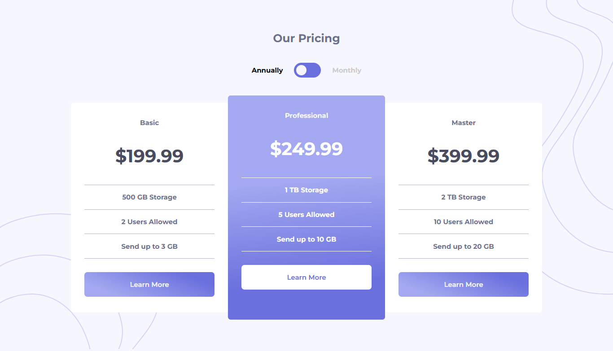
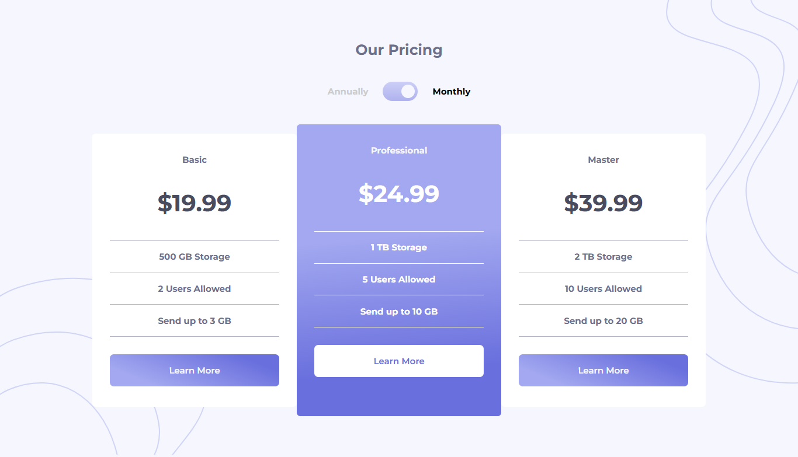
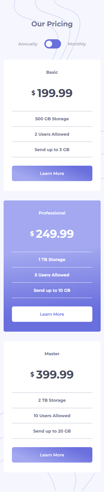
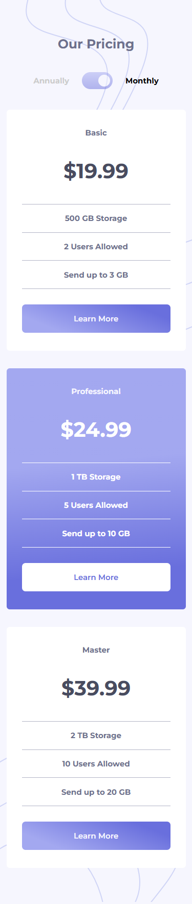

# Frontend Mentor - Pricing component with toggle solution

This is a solution to the [Pricing component with toggle challenge on Frontend Mentor](https://www.frontendmentor.io/challenges/pricing-component-with-toggle-8vPwRMIC). Frontend Mentor challenges help you improve your coding skills by building realistic projects.

## Table of contents

- [Overview](#overview)
  - [The challenge](#the-challenge)
  - [Screenshot](#screenshot)
  - [Links](#links)
- [My process](#my-process)
  - [Built with](#built-with)
- [Author](#author)

## Overview

### The challenge

Users should be able to:

- View the optimal layout for the component depending on their device's screen size.
- Control the toggle with both their mouse/trackpad and their keyboard.
- **Bonus**: Complete the challenge with just HTML and CSS.

### Screenshot

### Links

- Solution URL: [https://your-solution-url.com]
- Live Site URL: [https://github.com/lizSilva27/PricingComponentWithToggle_FrontendMentor]

## My process

### Built with

- Semantic HTML5 markup
- SASS custom properties
- Flexbox
- Mobile-first workflow
- [SASS](https://sass-lang.com/)

## Author

- Frontend Mentor - [@lizSilva27](https://www.frontendmentor.io/profile/lizSilva27)
